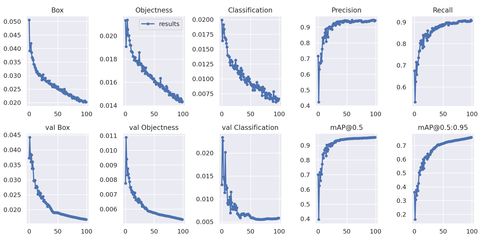
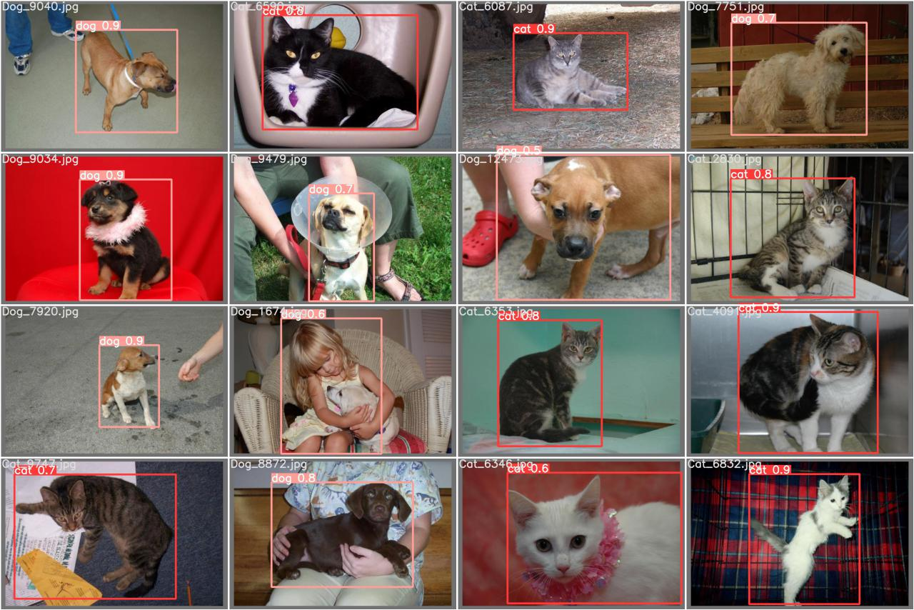

# ANGELSWING DEVELPMENT TEST

This repository represents the submission of ANGELSWING DEVELPMENT TEST.

&nbsp;

# Written Response
The answer to questions is stored [here](Answer/Answers.md) in markdown format.

&nbsp;
&nbsp;


# API Test

## Run

```python
python restapi.py --port 5000 --weight './model/best.pt'
```

## Request
```bash
curl --request POST 'http://localhost:5000/predict' --data-raw '{"image_path": "./data/Cat_1929.jpg"}'
```

## response
```bash
{
  'prediction': [
    {
    'label': 'cat',
    'confidence': '0.68408203125',
    'bbox': '[67.46406555175781, 101.2015609741211, 238.8718719482422, 448.8718566894531]'
    }
  ]
}
```

# Training (reference)
## Train

The results below were trained through pre-processed petimages. Training times for YOLOv5s are 2 days on a single p40. 
```bash
$ python train.py --data data/pet_dataset.yaml --hyp hyp.yaml --weights 'yolov5s.pt' --batch-size 64
```
Detail hyper-parameters ([click](hyp.yaml))

Detail options ([click](opt.yaml))


## Results
<p align="left"></p>

## Sample image
Image label sample         |          Test prediction sample
:-------------------------:|:-------------------------:
  |  
